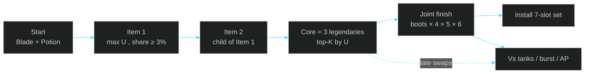

<div align="center">


<br/>

[](https://github.com/PersianXM/markov-kaisa)
[](RUN.bat)
[](https://lolalytics.com/lol/kaisa/build/)
[](RUN.bat)

**یک کلیک → دادهٔ زندهٔ Lolalytics → بیشینه‌سازی $U$ → نصب آیتم‌ست در کلاینت**


</div>

---

## این برنامه چه می‌کند؟

`RUN.bat` پچ زنده را از Lolalytics می‌خواند، مسیرهای **Actually-Built** را برای Kai'Sa در Silver EUW امتیاز می‌دهد، و یک آیتم‌ست ۷ اسلاته (۶ لجندری + بوت) به نام **Markov Kai'Sa** داخل کلاینت می‌نویسد.

رتب پیش‌فرض **silver** است. بعد از پروموت، در `RUN.bat` بنویسید `set RANK=gold`.

```text
G:\Riot Games\League of Legends\Config\ItemSets.json
```

کلاینت را کامل ببندید و دوباره باز کنید تا ست دیده شود.

---

## فرمول اصلی

<div align="center">

</div>

برنامه **وین‌ریت خام را بیشینه نمی‌کند**. وین‌ریت خام مسیرهای کمیاب و مسیرهایی که فقط وقتی جلو هستید کامل می‌شوند را باد می‌کند. به‌جای آن این زنجیره را حل می‌کند:

$$
\hat p = \frac{W}{n}
\qquad
\tilde p = \frac{W + \alpha\, p_0}{n + \alpha}
\qquad
\Delta = \tilde p - p_{\mathrm{avg}}
$$

$$
\mathrm{CI}_{95} = 1.96 \sqrt{\frac{\tilde p\,(1-\tilde p)}{n+\alpha}}
\qquad
U = \Delta - \lambda\cdot\mathrm{CI}_{95}
$$

| نماد | معنی | پیش‌فرض |
| :---: | :--- | :---: |
| $W,\,n$ | برد و بازی‌های Actually-Built آن مسیر | از API |
| $p_0$ | وین‌ریت قهرمان در همان رنک/سرور | زنده |
| $p_{\mathrm{avg}}$ | خط مبنا (معمولاً $0.50$) | زنده |
| $\alpha$ | شدت جمع‌شدن Empirical Bayes | $800$ |
| $\lambda$ | جریمهٔ عدم‌قطعیت | $0.55$ |
| $U$ | مطلوبیت نهایی مسیر | $\arg\max$ |

<div dir="rtl">

- $\tilde p$ وین‌ریت را به سمت $p_0$ می‌کشد: مسیر $n=200$ با WR دروغین ۵۸٪ دیگر قهرمان جدول نمی‌شود.
- $\Delta$ از WR خام مهم‌تر است: ۵۲٪ روی قهرمانی که ۴۷٫۵٪ است بهتر از ۵۱٪ روی قهرمان ۵۱٪ است.
- $\lambda\cdot\mathrm{CI}$ مسیر کم‌نمونه را جریمه می‌کند. اگر $n < n_{\min}$ باشد، $U$ اصلاً تعریف نمی‌شود و مسیر حذف می‌شود.

</div>

---

## منطق مارکوف مرحله‌ای

بیلد یک تصمیم یک‌جا نیست. هر خرید، شرطی روی خریدهای قبلی است:

$$
\pi^\star
=
\arg\max_{i_t}
\;
U\!\left(i_t \mid i_1,\ldots,i_{t-1}\right)
$$

یعنی Item 2 فقط بین فرزندهای Item 1 انتخاب می‌شود، Item 3 فقط بین فرزندهای همان جفت، و الی آخر.



<div dir="rtl">

این یک زنجیرهٔ مارکوف **تصمیم** است، نه ادعای اینکه بازی واقعاً مارکوف است. حالت = آیتم‌های خریده‌شده. عمل = آیتم بعدی. پاداش ≈ $U$ شرطی.

</div>

---

## Actually-Built، نه Exact

Lolalytics دو جدول دارد:

| جدول | چه می‌شمارد | مشکل |
| :---: | :--- | :--- |
| Exact | فقط بازی‌هایی که دقیقاً همان $t$ آیتم را تمام کرده‌اند | بازیکن بازنده FF می‌کند → WR مصنوعی پایین |
| **Actually-Built** | هر بازی که آن پیشوند را ساخته، حتی اگر بعداً آیتم بیشتری خریده | همان چیزی که برنامه جمع می‌زند |

$$
n_t(i_1,\ldots,i_t)
=
\sum_{k \ge t}
n^{\mathrm{exact}}_k(i_1,\ldots,i_t,\,\cdot)
$$

پس Statikk→Rageblade بازی‌هایی را هم شامل می‌شود که بعداً Nashor یا Dusk گرفته‌اند.

---

## هسته + جستجوی مشترک late

Core سه‌آیتمه با $U$ رتبه‌بندی می‌شود. بعد به‌جای قفل کردن یک core و حرص late، $K=3$ هستهٔ برتر با بوت و آیتم ۴–۶ با هم امتیاز می‌گیرند:

$$
U_{45}=U(i_4,i_5\mid \mathrm{core})
\qquad
U_{\mathrm{joint}}
=
\tfrac12 U_{45}
+
\tfrac14 U_{\mathrm{boots}}
+
\tfrac14 U_{6}
$$

$$
U_{\mathrm{total}}
=
0.55\,U_{\mathrm{core}}
+
0.45\,U_{\mathrm{joint}}
$$

آیتم ۶ در API معمولاً `itemSet6` ندارد؛ از حضور late روی تکمیل‌های ۵آیتمه به‌عنوان پروکسی استفاده می‌شود.

اگر هیچ مسیری از کف $n$ رد نشود، **پرتکرارترین فرزند** گرفته می‌شود، نه یک آیتم هاردکد.

---

## پرایور سلسله‌مراتبی برای آیتم دیر

نمونهٔ Silver برای آیتم ۴–۶ نازک است. وین‌ریت shrunk با پرایور Emerald EUW مخلوط می‌شود:

$$
\tilde p_{\mathrm{hier}}
=
\frac{W_{\mathrm{S}} + \alpha_{\mathrm{loc}}\, \hat p_{\mathrm{Emerald}}}{n_{\mathrm{S}} + \alpha_{\mathrm{loc}}}
$$

$$
\alpha_{\mathrm{loc}}
=
\max\!\left(
\alpha,\;
\begin{cases}
400 & n_{\mathrm{S}}\ge 800 \\
800 & n_{\mathrm{S}}\ge 200 \\
1200 & \text{وگرنه}
\end{cases}
\right)
$$

هرچه Silver کم‌نمونه باشد، Emerald بیشتر حرف می‌زند. KR پرایور Silver EUW نیست.

---

## کف نمونه و سهم پیک

مسیر فقط وقتی وارد رقابت می‌شود که:

$$
n \ge n_{\min}(t)
\qquad\text{و}\qquad
\frac{n}{N_{\mathrm{champ}}} \ge s(t)
$$

| مرحله | $n_{\min}$ | سهم پیک |
| :---: | :---: | :---: |
| Start | 2000 | — |
| Item 1 | 1500 | 3% |
| Pair | 1200 | 1.5% |
| Core | 800 | 1% |
| Item 4 / 5 / 6 | 800 / 400 / 250 | — |

این کنترل مخدوش‌کنندهٔ عملی است، نه علیت کامل: مسیرهای کمیابِ «خوش‌شانس» حذف می‌شوند.

---

## تنظیم $\alpha$ و $\lambda$

گرید:

$$
(\alpha,\lambda)\in
\{400,800,1600\}\times\{0.30,0.55,0.80\}
\quad\text{(سلول‌های استفاده‌شده در کد)}
$$

- **روز اول:** هسته‌ای که بیشترین سلول گرید روی آن توافق دارند (`grid_consensus`)
- **از فردا:** همان سلول‌ها روی دادهٔ امروز holdout می‌شوند؛ $(\alpha,\lambda)$ با بیشترین $U$ امروز می‌ماند

اگر یک core سه روز پشت‌سرهم `faded` شود ($\Delta U \le -0.01$)، هفت روز بلاک می‌شود.

---

## آیتم‌ست داخل کلاینت چه معنایی دارد؟

| بلوک | نقش |
| :--- | :--- |
| **Starting** | Doran's Blade + Potion |
| **Buy order** | پیش‌فرض ۷ اسلات |
| **Late swaps** | جایگزین آیتم ۴–۶ / اسلات ۷ |
| **Vs tanks / burst / AP** | فقط جایگزین late، **نه core** |
| **Wards** | کنترل و سوئیپر |

Statikk → Rageblade → Nashor را عوض نکنید. LDR یا GA به‌جای Rabadon / Dusk / Zhonya می‌آیند، نه به‌جای هسته.

---

## اجرا

پیش‌نیاز: Python 3.

```bat
RUN.bat
```

یا:

```bash
python markov_kaisa.py --tier silver
```

خروجی‌ها:

| مسیر | محتوا |
| :--- | :--- |
| `output/decision.json` | امتیازها، $U$، گرید |
| `history/daily.jsonl` | اعتبارسنجی روز بعد |
| `Config\ItemSets.json` | ست داخل کلاینت |

---

## چیزی که این روش نیست

<div dir="rtl">

این یک **تخمین‌گر تحت‌مدل** است، نه اثبات علّی «بهترین بیلد جهان».

۵۳٪ بعد از کامل شدن core یعنی «اگر تا آیتم سوم رسیده‌اید»، نه شانس ورود به بازی. برای بازیکن متوسط Silver EUW در یک بازی منصفانه، بیلد خوب قهرمان را نزدیک خط تساوی می‌آورد؛ فاصلهٔ ۴۷٫۶٪ → ۵۳٪ بیشتر انتخاب نمونه است تا جادوی آیتم.

</div>

---

<div align="center">

**$\displaystyle \arg\max U$** &nbsp;·&nbsp; not &nbsp;·&nbsp; **$\displaystyle \arg\max \hat p$**

<br/>

<sub>Markov Kai'Sa · Silver EUW · live Lolalytics · League item set</sub>

</div>
