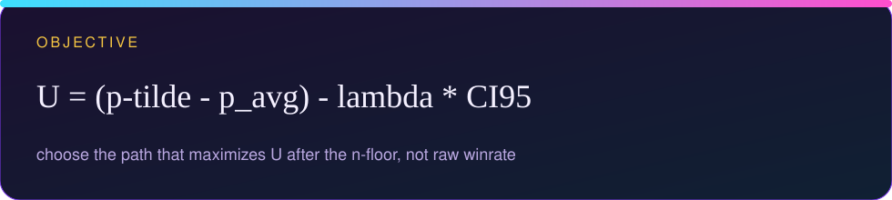
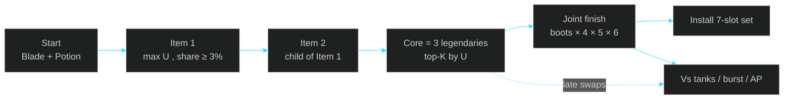

<div align="center">


<br/>

[](https://github.com/PersianXM/markov-kaisa)
[](RUN.bat)
[](https://lolalytics.com/lol/kaisa/build/)
[](RUN.bat)

**One click → live Lolalytics → maximize $U$ → install the League item set**


</div>

---

## What this does

`RUN.bat` reads the live patch from Lolalytics, scores **Actually-Built** Kai'Sa paths for Silver EUW, and installs a 7-slot item set (6 legendaries + boots) named **Markov Kai'Sa** into the League client.

Default rank is **silver**. After you promote, set `RANK=gold` at the top of `RUN.bat`.

```text
G:\Riot Games\League of Legends\Config\ItemSets.json
```

Fully close and reopen the League client so the set appears.

---

## Core formula

<div align="center">

</div>

The program does **not** maximize raw winrate. Raw WR inflates rare paths and paths that only finish when you are already winning. Instead it solves:

$$
\hat p = \frac{W}{n}
\qquad
\tilde p = \frac{W + \alpha\, p_0}{n + \alpha}
\qquad
\Delta = \tilde p - p_{\mathrm{avg}}
$$

$$
\mathrm{CI}_{95} = 1.96 \sqrt{\frac{\tilde p\,(1-\tilde p)}{n+\alpha}}
\qquad
U = \Delta - \lambda\cdot\mathrm{CI}_{95}
$$

| Symbol | Meaning | Default |
| :---: | :--- | :---: |
| $W,\,n$ | Wins and games for that Actually-Built path | live API |
| $p_0$ | Champion winrate for the same rank/region | live |
| $p_{\mathrm{avg}}$ | Baseline (usually $0.50$) | live |
| $\alpha$ | Empirical Bayes shrinkage strength | $800$ |
| $\lambda$ | Uncertainty penalty | $0.55$ |
| $U$ | Path utility | $\arg\max$ |

- $\tilde p$ pulls noisy WR toward $p_0$: a path with $n=200$ and fake 58% WR does not win the table.
- $\Delta$ matters more than raw WR: 52% on a 47.5% champion beats 51% on a 51% champion.
- $\lambda\cdot\mathrm{CI}$ penalizes thin samples. If $n < n_{\min}$, $U$ is undefined and the path is rejected.

---

## Stagewise Markov logic

A build is not one global choice. Each purchase is conditional on what you already bought:

$$
\pi^\star
=
\arg\max_{i_t}
\;
U\!\left(i_t \mid i_1,\ldots,i_{t-1}\right)
$$

Item 2 is chosen only among children of Item 1; Item 3 only among children of that pair; and so on.



This is a Markov **decision** chain, not a claim that the game itself is Markov. State = items owned. Action = next item. Reward ≈ conditional $U$.

---

## Actually-Built, not Exact

Lolalytics exposes two tables:

| Table | Counts | Problem |
| :---: | :--- | :--- |
| Exact | Only games that finished at exactly those $t$ items | Losers FF early → artificially low WR |
| **Actually-Built** | Every game that built that prefix, even if more items followed | What this program aggregates |

$$
n_t(i_1,\ldots,i_t)
=
\sum_{k \ge t}
n^{\mathrm{exact}}_k(i_1,\ldots,i_t,\,\cdot)
$$

So Statikk→Rageblade also includes games that later bought Nashor or Dusk.

---

## Core + joint late search

The 3-item core is ranked by $U$. Instead of locking one core and greedily finishing, the top $K=3$ cores are scored together with boots and items 4–6:

$$
U_{45}=U(i_4,i_5\mid \mathrm{core})
\qquad
U_{\mathrm{joint}}
=
\tfrac12 U_{45}
+
\tfrac14 U_{\mathrm{boots}}
+
\tfrac14 U_{6}
$$

$$
U_{\mathrm{total}}
=
0.55\,U_{\mathrm{core}}
+
0.45\,U_{\mathrm{joint}}
$$

Item 6 usually has no `itemSet6` in the API; it is chosen from late presence on 5-item completions.

If no path clears the $n$ floor, the program uses the **most common** child, not a hardcoded item.

---

## Hierarchical prior for late items

Silver samples for items 4–6 are thin. The shrunk rate is mixed with an Emerald EUW prior:

$$
\tilde p_{\mathrm{hier}}
=
\frac{W_{\mathrm{S}} + \alpha_{\mathrm{loc}}\, \hat p_{\mathrm{Emerald}}}{n_{\mathrm{S}} + \alpha_{\mathrm{loc}}}
$$

$$
\alpha_{\mathrm{loc}}
=
\max\!\left(
\alpha,\;
\begin{cases}
400 & n_{\mathrm{S}}\ge 800 \\
800 & n_{\mathrm{S}}\ge 200 \\
1200 & \text{otherwise}
\end{cases}
\right)
$$

Thinner Silver samples lean harder on Emerald. KR is not the prior for Silver EUW.

---

## Sample floors and pick share

A path only competes when:

$$
n \ge n_{\min}(t)
\qquad\text{and}\qquad
\frac{n}{N_{\mathrm{champ}}} \ge s(t)
$$

| Stage | $n_{\min}$ | Pick share |
| :---: | :---: | :---: |
| Start | 2000 | — |
| Item 1 | 1500 | 3% |
| Pair | 1200 | 1.5% |
| Core | 800 | 1% |
| Item 4 / 5 / 6 | 800 / 400 / 250 | — |

This is practical confounding control, not full causality: lucky rare paths are dropped.

---

## Tuning $\alpha$ and $\lambda$

Grid:

$$
(\alpha,\lambda)\in
\{400,800,1600\}\times\{0.30,0.55,0.80\}
\quad\text{(cells used in code)}
$$

- **Day one:** modal core across the grid (`grid_consensus`)
- **From day two:** yesterday's cells are held out on today's data; keep the $(\alpha,\lambda)$ with the best today-$U$

If a core is `faded` three days in a row ($\Delta U \le -0.01$), it is blacklisted for seven days.

---

## What the client item set means

| Block | Role |
| :--- | :--- |
| **Starting** | Doran's Blade + Potion |
| **Buy order** | Default 7-slot path |
| **Late swaps** | Replacements for items 4–6 / slot 7 |
| **Vs tanks / burst / AP** | Late replacements only, **not core** |
| **Wards** | Control ward and sweeper |

Do not replace Statikk → Rageblade → Nashor. LDR or GA replace Rabadon / Dusk / Zhonya, not the core.

---

## Run

Requires Python 3.

```bat
RUN.bat
```

Or:

```bash
python markov_kaisa.py --tier silver
```

Outputs:

| Path | Contents |
| :--- | :--- |
| `output/decision.json` | Scores, $U$, hyperparameter grid |
| `history/daily.jsonl` | Next-day validation snapshots |
| `Config\ItemSets.json` | Client item set |

---

## What this method is not

This is an **under-model estimator**, not a causal proof of the “best build in the world.”

53% after completing the core means “given you reached item three,” not your chance when you enter the game. For an average Silver EUW player in a fair lobby, a good build moves the champion toward even; most of the 47.6% → 53% jump is selection bias, not item magic.

---

<div align="center">

**$\displaystyle \arg\max U$** &nbsp;·&nbsp; not &nbsp;·&nbsp; **$\displaystyle \arg\max \hat p$**

<br/>

<sub>Markov Kai'Sa · Silver EUW · live Lolalytics · League item set</sub>

</div>
