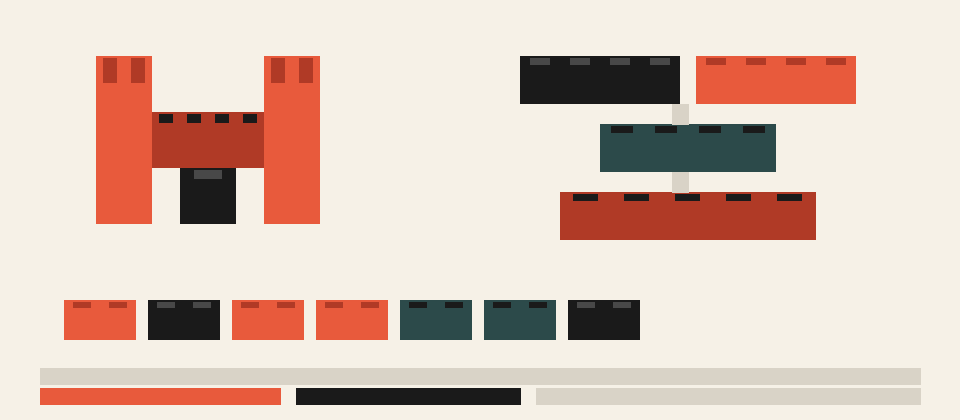
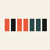
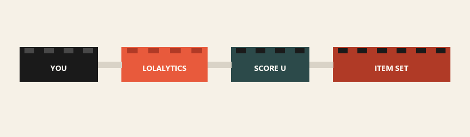
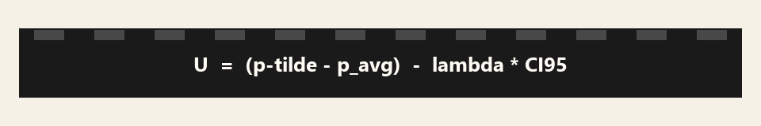

<div align="center">



# MARKOV KAISA

**Live Lolalytics in. A 7-slot item set out. Maximize $U$, not raw winrate.**

[](RUN.bat)
[](https://lolalytics.com/lol/kaisa/build/)
[](markov_kaisa.py)
[](RUN.bat)

[Repo](https://github.com/PersianXM/markov-kaisa)
·
[Lolalytics](https://lolalytics.com/lol/kaisa/build/)
·
[Source](markov_kaisa.py)

<p><sub>■ ■ ■  ■ ■</sub></p>

</div>

## Overview

Markov Kai'Sa is a one-key generator for a League of Legends item set. It reads live Kai'Sa ADC data, scores item paths as a stagewise decision chain, and writes **Markov Kai'Sa** into the client.

Silver is only the **default cursor** in the rank menu. The same protocol runs on any Lolalytics bracket.

```text
YOU  ■  LOLALYTICS  ■  SCORE U  ■  ITEMSETS.JSON
```

<p align="center"><sub>■  ■ ■ ■ ■ ■  ■</sub></p>

## Features

<table>
<tr>
<td width="33%" valign="top">
<br>
<strong>LIVE PATCH</strong><br>
Reads the patch Lolalytics is serving now. No hardcoded version.
</td>
<td width="33%" valign="top">
<br>
<strong>ANY RANK</strong><br>
Arrow keys in <code>RUN.bat</code>. Iron through Challenger, plus the <code>+ / all</code> filters.
</td>
<td width="33%" valign="top">
<br>
<strong>U, NOT RAW WR</strong><br>
Shrinkage, delta vs baseline, then an uncertainty penalty.
</td>
</tr>
<tr>
<td width="33%" valign="top">
<br>
<strong>7 SLOTS</strong><br>
Six legendaries and boots. Item 6 uses late presence when the API stops at 5.
</td>
<td width="33%" valign="top">
<br>
<strong>NEXT-DAY CHECK</strong><br>
Yesterday's core is rescored on today's sample: stable, faded, or improved.
</td>
<td width="33%" valign="top">
<br>
<strong>RANK + PRIOR</strong><br>
Your rank is the likelihood. A thicker nearby rank is the late-item prior.
</td>
</tr>
</table>

<p align="center"><sub>■ ■    ■ ■ ■</sub></p>

## Architecture

<div align="center">

</div>

```text
┌──────────┐     ┌──────────────┐     ┌──────────┐     ┌───────────┐
│   YOU    │ ──► │  LOLALYTICS  │ ──► │  SCORE U │ ──► │ ITEM SET  │
│  rank +  │     │ Actually-    │     │ shrink,  │     │ 7 slots + │
│  RUN.bat │     │ Built paths  │     │ Δ, CI    │     │ late swap │
└──────────┘     └──────────────┘     └──────────┘     └───────────┘
```

State is the items already bought. Action is the next brick. Reward is conditional $U$.

<p align="center"><sub>■ ■ ■ ■  ■</sub></p>

## Installation

Needs **Python 3**. Clone, then double-click the launcher.

```bat
git clone https://github.com/PersianXM/markov-kaisa.git
cd markov-kaisa
RUN.bat
```

League install path is in `config.json` (`league_root`). Default points at `G:\Riot Games\League of Legends`.

<p align="center"><sub>■  ■ ■  ■</sub></p>

## Quick Start

1. Run `RUN.bat`.
2. **Up / Down** to pick a rank. **Enter** confirms. **Esc** cancels.
3. Wait for the fetch + score pass.
4. Fully close League, then reopen it.
5. Select Kai'Sa. Open **Item Sets**. Use **Markov Kai'Sa**.

```bat
RUN.bat
```

<p align="center"><sub>■ ■ ■  ■ ■ ■</sub></p>

## Usage

```bash
python markov_kaisa.py --pick-tier
python markov_kaisa.py --tier gold
python markov_kaisa.py --tier emerald_plus
```

| Brick | Writes |
| :--- | :--- |
| `output/decision.json` | Scores, $U$, grid |
| `history/daily.jsonl` | Validation snapshots |
| `Config\ItemSets.json` | Client item set |

Client path:

```text
G:\Riot Games\League of Legends\Config\ItemSets.json
```

<p align="center"><sub>■ ■  ■  ■ ■</sub></p>

## Configuration

Edit `config.json` for paths and floors. Rank does **not** belong there for daily use — pick it in the launcher.

| Key | Role |
| :--- | :--- |
| `alpha_rank` | Empirical Bayes strength (default `800`) |
| `lambda_risk` | CI penalty (default `0.55`) |
| `n_min_*` | Hard sample floors by stage |
| `min_pick_share_*` | Drop rare paths |
| `core_search_k` | How many cores enter joint search |
| `league_root` | League install |

```json
{
  "build_title": "Markov Kai'Sa",
  "tier": "silver",
  "region": "euw",
  "alpha_rank": 800,
  "lambda_risk": 0.55
}
```

<p align="center"><sub>■    ■ ■ ■ ■</sub></p>

## The formula

<div align="center">

</div>

Raw winrate is the wrong objective. It rewards rare paths and paths that only finish when you are already winning.

$$
\hat p = \frac{W}{n}
\qquad
\tilde p = \frac{W + \alpha\, p_0}{n + \alpha}
\qquad
\Delta = \tilde p - p_{\mathrm{avg}}
$$

$$
\mathrm{CI}_{95} = 1.96 \sqrt{\frac{\tilde p\,(1-\tilde p)}{n+\alpha}}
\qquad
U = \Delta - \lambda\cdot\mathrm{CI}_{95}
$$

| Symbol | Meaning |
| :---: | :--- |
| $W,\,n$ | Actually-Built wins and games |
| $p_0$ | Champion WR in that rank/region |
| $p_{\mathrm{avg}}$ | Baseline, usually $0.50$ |
| $\alpha$ | Shrinkage |
| $\lambda$ | Risk penalty |
| $U$ | What we maximize |

A path with $n < n_{\min}$ has no $U$. It is rejected.

**Actually-Built**, not Exact: losers who FF never finish Exact rows, so Exact WR is biased down.

$$
n_t(i_1,\ldots,i_t)
=
\sum_{k \ge t}
n^{\mathrm{exact}}_k(i_1,\ldots,i_t,\,\cdot)
$$

<p align="center"><sub>■ ■ ■ ■ ■</sub></p>

## Examples

Stagewise choice:

$$
\pi^\star = \arg\max_{i_t} \; U(i_t \mid i_1,\ldots,i_{t-1})
$$

Joint finish over the top cores:

$$
U_{\mathrm{joint}} = \tfrac12 U_{45} + \tfrac14 U_{\mathrm{boots}} + \tfrac14 U_{6}
\qquad
U_{\mathrm{total}} = 0.55\,U_{\mathrm{core}} + 0.45\,U_{\mathrm{joint}}
$$

Late prior (thicker nearby rank, not KR for EUW):

$$
\tilde p_{\mathrm{hier}}
=
\frac{W_{\mathrm{rank}} + \alpha_{\mathrm{loc}}\, \hat p_{\mathrm{prior}}}{n_{\mathrm{rank}} + \alpha_{\mathrm{loc}}}
$$

**How to use the set in-game**

| Block | Use |
| :--- | :--- |
| Starting | Blade + potion |
| Buy order | Default 7-slot path |
| Late swaps | Replace items 4–6 only |
| Vs tanks / burst / AP | Same: late only, never core |
| Wards | Control + sweeper |

Do not swap the 3-item core for a situational brick.

<p align="center"><sub>■ ■  ■ ■</sub></p>

## Project structure

```text
markov-kaisa/
├── RUN.bat                 launcher + rank picker
├── markov_kaisa.py         fetch, score, install
├── config.json             paths and floors
├── README.md
├── docs/assets/            block graphics
├── history/                daily validation
└── output/                 decision + selected rank
```

<p align="center"><sub>■  ■ ■ ■  ■</sub></p>

## Technology stack

```text
┌────────────┐  ┌────────────┐  ┌────────────┐  ┌────────────┐
│  PYTHON 3  │  │ LOLALYTICS │  │  DDRAGON   │  │ LEAGUE CFG │
└────────────┘  └────────────┘  └────────────┘  └────────────┘
```

No extra pip packages for the generator. Stdlib only.

<p align="center"><sub>■ ■ ■    ■</sub></p>

## Roadmap

```text
[■] stagewise U
[■] joint late search
[■] any-rank picker
[■] daily holdout
[ ] richer matchup policy from live enemy data
[ ] true 7-slot likelihood if Lolalytics adds itemSet6
```

This remains an **under-model estimator**, not a causal proof of the best build.

<p align="center"><sub>■  ■  ■</sub></p>

## Contributing

Open an issue or a PR on [`PersianXM/markov-kaisa`](https://github.com/PersianXM/markov-kaisa). Keep changes small: one protocol brick per PR.

<p align="center"><sub>■ ■ ■ ■  ■ ■</sub></p>

## License

No license file is published in this repository yet. Treat the code as source-available until one is added.

---

<div align="center">

**$\arg\max U$** &nbsp;■&nbsp; not &nbsp;■&nbsp; **$\arg\max \hat p$**

<sub>■ Markov Kai'Sa ■ any rank ■ live data ■</sub>

</div>
